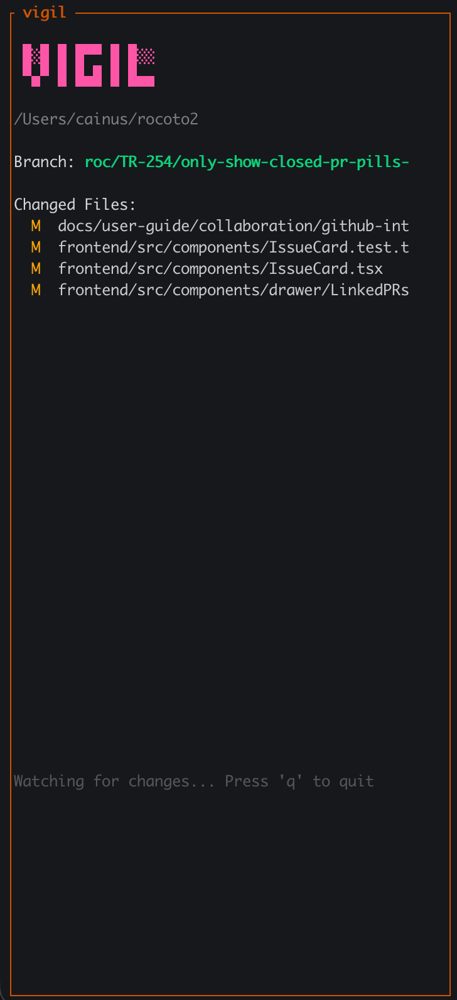

# vigil

A real-time git status watcher for your terminal.



## Features

- Live-updating view of uncommitted changes
- Watches your working directory for file changes
- Shows current branch name
- Color-coded status indicators (modified, added, deleted, untracked)
- Handles edge cases like detached HEAD and repos with no commits

## Installation

```bash
go install github.com/cainus/vigil@latest
```

Or build from source:

```bash
git clone https://github.com/cainus/vigil.git
cd vigil
go build
```

## Usage

Run `vigil` from any git repository:

```bash
cd your-repo
vigil
```

Press `q` to quit.

## Status Indicators

| Status | Meaning |
|--------|---------|
| `M` | Modified |
| `A` | Added |
| `D` | Deleted |
| `R` | Renamed |
| `??` | Untracked |

## License

MIT
